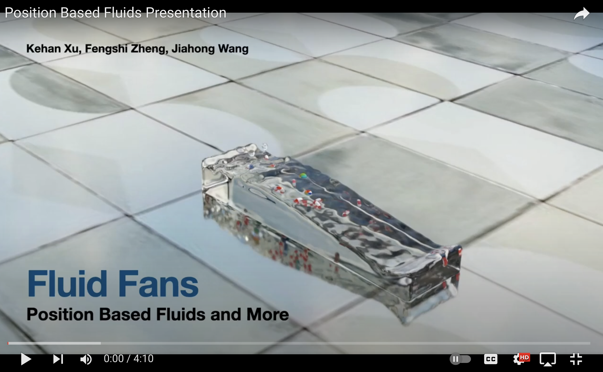

Position-Based-Fluids-Taichi
=====================================
**Authors: Kehan Xu ([LinkedIn](https://www.linkedin.com/in/kehan-xu-356139159/) | [Github](https://github.com/Fiona730) | [Personal Website](https://fiona730.github.io)), Fengshi Zheng ([Github](https://github.com/JamesZFS)) and Jiahong Wang**

<p align="center"></p>

This is our group project for [Physically-based Simulation](https://cgl.ethz.ch/teaching/simulation21/home.php) course at ETH Zurich. We implemented [position based fluids](https://mmacklin.com/pbf_sig_preprint.pdf) (PBF) in 3D space with [Taichi](https://github.com/taichi-dev/taichi), a high-performance parallel language wrapped in python.

## Presentation Video (Click to Watch)

[](https://www.youtube.com/watch?v=QSVyB660CUs)

## Position Based Fluids
When doing fluid simulation, fluid is modeled as a bunch of small particles. Enforcing incompressibility (i.e. constant density) is crucial to achieve visual realism. 

Position based fluids follows the idea of the [position based dynamics](https://matthias-research.github.io/pages/publications/posBasedDyn.pdf) framework: it proposes an iterative density solver to solve a set of positional constraints that enforce constant density.

Position Based Fluids yields stable simulation even under large time steps, while still achieving similar incormpressibility and convergence to [smoothed-particle hydrodynamics](https://en.wikipedia.org/wiki/Smoothed-particle_hydrodynamics) (SPH) method.

## Implementation
We follow the method described in the [PBF paper](https://mmacklin.com/pbf_sig_preprint.pdf), including the improvement of vorticity confinement and XSPH viscosity (Section 4 and 5).

Pseudocode of the simulation process:
```c++
For each iteration:
    For each particle:
        Update velocity with external forces
        Update position using updated velocity
        Modify position to meet the constraints (constant density)
        Re-compute velocity with the modified position
```

We also add logic for object collision so as to not only simulate fluid itself but also meshes surrounded by fluid. In this case, the collision is between the object and multiple fluid particles. The method to model collision by imposing nonpenetration constraints is referred from [here](https://www.cs.cmu.edu/~baraff/sigcourse/notesd2.pdf).

## Code Usage
Simply run `python main.py` to start fluid simulation.

You can adjust parameters for fluid simulation and visualization in `config.py`.

The implementation of position based fluids is in `pbf.py`. `rigidbody.py` contains the code for object collison.

## Rendering
In every frame, the simulation output is a bunch of particle positions. We use [splashsurf](https://github.com/w1th0utnam3/splashsurf) to reconstruct surface for particle data. The generated water mesh is then rendered using [Blender](https://www.blender.org), along with other objects (ball, torus, terrain etc.).

We have written a script for this purpose, see the [rendering branch](xxx).

## Gallery
<p align="center"></p>
<p align="center"></p>